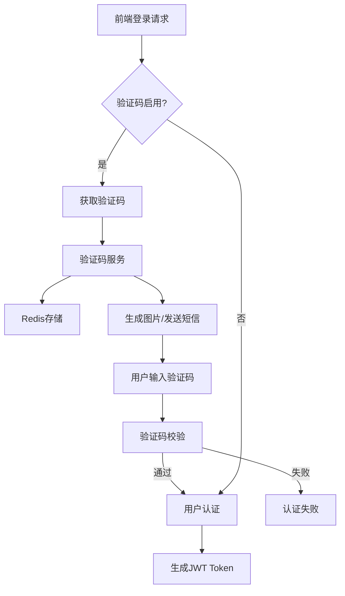
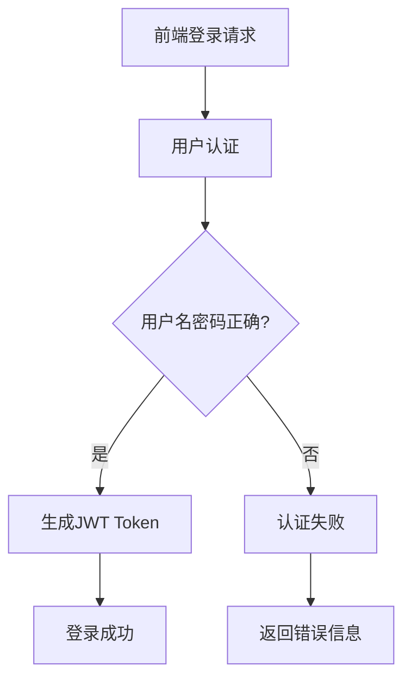

# 去除登录认证验证码功能设计文档

## 概述

本设计文档描述了如何从xAdmin FastAPI后端系统中完全移除验证码功能，包括图形验证码(Captcha)和短信/邮件验证码(VerifyCode)。目标是简化认证流程，提升用户体验，同时保持系统安全性。

## 架构影响分析

### 当前验证码架构



### 移除后架构



## 技术实现

### 需要删除的文件

| 文件路径 | 文件类型 | 删除原因 |
|---------|---------|---------|
| `app/api/captcha.py` | API路由 | 完整的验证码API接口文件 |
| `app/services/captcha.py` | 服务层 | 验证码业务逻辑实现 |
| `app/services/verify_code.py` | 服务层 | 短信/邮件验证码服务 |

### 需要修改的文件

#### 1. `app/api/auth.py` - 认证API路由
**修改目标**: 移除所有验证码相关的参数验证和校验逻辑

**具体修改**:
- 移除 `CaptchaService` 和 `VerifyCodeService` 的导入
- 移除验证码相关的Schema导入
- 简化登录接口，去除验证码验证逻辑
- 移除验证码获取接口 `/auth/captcha`
- 移除验证码发送接口 `/auth/verify`

#### 2. `app/schemas/auth.py` - 认证Schema
**修改目标**: 移除验证码相关的请求/响应模型

**具体修改**:
- 移除 `LoginRequest` 中的验证码字段
- 移除 `RegisterRequest` 中的验证码字段
- 删除验证码相关的响应模型类

#### 3. `app/core/config.py` - 配置文件
**修改目标**: 移除验证码相关配置项

**具体修改**:
- 删除 `CAPTCHA_ENABLED` 配置项
- 保留其他安全配置以维持系统安全性

#### 4. `main.py` - 主应用入口
**修改目标**: 移除验证码路由注册

**具体修改**:
- 移除 `captcha` 路由的导入和注册

### API接口变更

#### 登录配置接口 `/login/basic` (GET)
**变更前**:
```json
{
  "code": 1000,
  "detail": "success",
  "data": {
    "access": true,
    "captcha": true,
    "token": false,
    "encrypted": false,
    "lifetime": 3600,
    "reset": true,
    "password": [],
    "email": true,
    "sms": false,
    "basic": true,
    "rate": 5
  }
}
```

**变更后**:
```json
{
  "code": 1000,
  "detail": "success",
  "data": {
    "access": true,
    "captcha": false,
    "token": false,
    "encrypted": false,
    "lifetime": 3600,
    "reset": true,
    "password": [],
    "email": true,
    "sms": false,
    "basic": true,
    "rate": 5
  }
}
```

#### 基础登录接口 `/login/basic` (POST)
**变更前**:
```json
{
  "username": "admin",
  "password": "password",
  "captcha_key": "abc123",
  "captcha_code": "ABCD",
  "remember_me": false
}
```

**变更后**:
```json
{
  "username": "admin", 
  "password": "password",
  "remember_me": false
}
```

#### 用户注册接口 `/register` (POST)
**变更前**:
```json
{
  "username": "newuser",
  "password": "password123",
  "confirm_password": "password123",
  "email": "user@example.com",
  "captcha_key": "xyz789",
  "captcha_code": "1234"
}
```

**变更后**:
```json
{
  "username": "newuser",
  "password": "password123", 
  "confirm_password": "password123",
  "email": "user@example.com"
}
```

### 删除的API端点

以下API端点将被完全移除:

| 端点 | 方法 | 功能描述 |
|------|------|----------|
| `/api/captcha` | GET | 获取图形验证码 |
| `/api/captcha/verify` | POST | 验证图形验证码 |
| `/api/captcha/config` | GET | 获取验证码配置 |
| `/api/verify-code/config` | GET | 获取验证码发送配置 |
| `/api/verify-code/send` | POST | 发送短信/邮件验证码 |
| `/api/verify-code/verify` | POST | 验证短信/邮件验证码 |
| `/api/temp-token` | GET | 获取临时令牌 |
| `/api/temp-token/verify` | POST | 验证临时令牌 |
| `/api/captcha/statistics` | GET | 验证码统计信息 |
| `/api/captcha/cleanup` | POST | 清理过期验证码 |
| `/auth/captcha` | GET | 获取验证码(认证模块) |
| `/auth/verify` | GET/POST | 验证码相关配置和发送 |
| `/login/code` | POST | 验证码登录 |

## 安全考虑

### 风险评估

| 风险类型 | 影响程度 | 缓解措施 |
|---------|----------|----------|
| 暴力破解攻击 | 高 | 实施IP频率限制、账户锁定机制 |
| 自动化注册 | 中 | 保留邮箱验证、用户行为分析 |
| 系统可用性 | 低 | 简化后系统更稳定 |

### 替代安全措施

1. **强化密码策略**
   - 保持现有的密码复杂度要求
   - 维持密码最小长度、大小写、数字要求

2. **增强频率限制**
   - 实施更严格的登录频率限制
   - 针对异常IP的自动封锁机制

3. **用户行为监控**
   - 记录登录日志
   - 异常登录行为检测

## 数据库影响

### Redis存储清理

验证码功能使用Redis存储临时数据，移除后需要清理的键模式:
- `captcha:*` - 图形验证码存储
- `verify_code:*` - 短信/邮件验证码存储

### 数据库表影响

如果存在验证码相关的数据库表，需要考虑是否删除或保留历史数据用于审计。

## 测试策略

### 单元测试更新

需要更新或删除的测试文件:
- `tests/api/test_captcha.py` - 删除验证码API测试
- `tests/services/test_captcha.py` - 删除验证码服务测试
- `tests/api/test_auth.py` - 更新认证API测试，移除验证码相关测试用例

### 集成测试

更新登录流程的集成测试:
- 简化登录测试场景
- 移除验证码验证的测试路径
- 确保无验证码情况下的正常登录功能

### 功能测试

1. **登录功能测试**
   - 用户名密码正确时能正常登录
   - 用户名或密码错误时返回合适错误信息
   - 频率限制机制正常工作

2. **注册功能测试**
   - 简化注册流程正常工作
   - 数据验证机制保持有效

## 部署注意事项

### 配置更新

1. **环境变量**
   - 移除 `CAPTCHA_ENABLED` 相关配置
   - 更新配置文档

2. **Redis配置**
   - 可选择性清理现有验证码数据
   - 更新Redis键空间配置

### 向后兼容性

- 前端需要同步更新，移除验证码相关UI组件
- API文档需要更新，移除已删除的端点
- 确保老版本客户端的平滑过渡

## 实施计划

### 第一阶段：代码清理
1. 删除验证码服务文件
2. 删除验证码API路由文件
3. 清理配置文件中的相关配置

### 第二阶段：接口简化
1. 简化登录接口实现
2. 更新Schema定义
3. 移除验证码相关导入

### 第三阶段：测试验证
1. 更新单元测试
2. 执行集成测试
3. 进行安全性测试

### 第四阶段：文档更新
1. 更新API文档
2. 更新部署文档
3. 更新安全策略文档